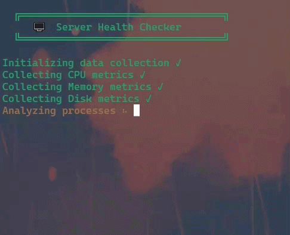
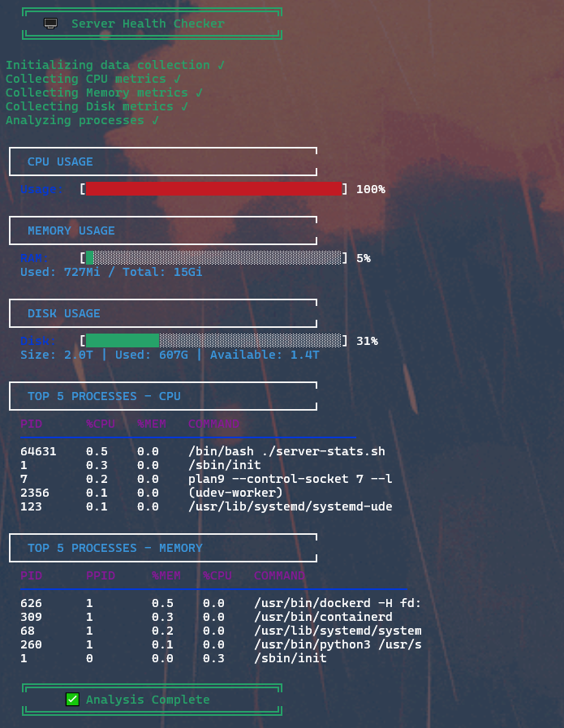

The project from: https://roadmap.sh/projects/server-stats

# 🖥️ Server Health Checker

Um script Bash elegante e interativo para monitorar a saúde do seu servidor Linux em tempo real, com barras de progresso visuais e interface colorida.


---

## 📋 Índice

- [Features](#-features)
- [Demo](#-Demo)
- [Instalação](#-instalação)

---

## ✨ Features

- 📊 **Monitoramento de CPU** - Uso atual com barra de progresso visual
- 🧠 **Monitoramento de RAM** - Memória usada/total com indicador de porcentagem
- 💾 **Monitoramento de Disco** - Espaço usado/disponível com barra colorida
- 🔥 **Top 5 Processos** - Por uso de CPU e Memória
- 🎨 **Interface Colorida** - Verde (OK), Amarelo (Atenção), Vermelho (Crítico)
- ⏳ **Animações de Loading** - Feedback visual durante a coleta de dados
- 🔒 **Segurança** - Suporte a arquivo `.env` para tokens sensíveis

---
## 🎬 Demonstração



*Clique na imagem para ver a demonstração completa*

### Screenshot Estático




## 🚀 Instalação

### Pré-requisitos

| Dependência | Versão Mínima | Como Verificar |
|-------------|---------------|----------------|
| Linux       | -             | `uname -a`     |
| Bash        | 4.0+          | `bash --version` |
| `top`       | -             | `which top`    |
| `free`      | -             | `which free`   |
| `df`        | -             | `which df`     |
| `ps`        | -             | `which ps`     |
| `bc`        | -             | `which bc`     |

### Instalar dependências

```bash
# Ubuntu/Debian
sudo apt-get update
sudo apt-get install -y procps coreutils bc

# CentOS/RHEL
sudo yum install -y procps-ng coreutils bc

# Fedora
sudo dnf install -y procps-ng coreutils bc

# Arch Linux
sudo pacman -S procps-ng coreutils bc 
```